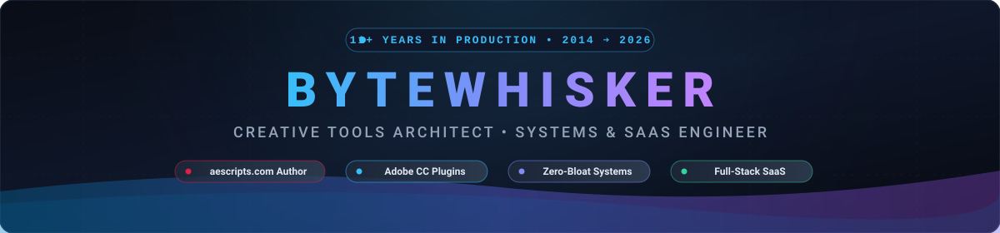
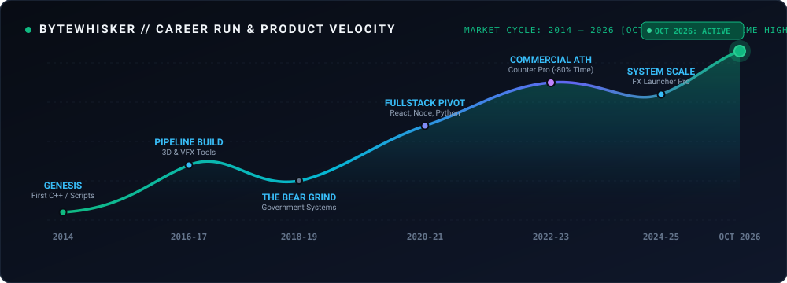

  

<h3 align="center">
  
</h3>

  <em>"11+ years engineering workflow-critical Adobe extensions, zero-bloat desktop utilities, and resilient web platforms."</em>

  
  
  
  
  

  
  
  

---

### Career Trajectory and System Velocity (2014 — Present)

  

<table>
  <tr>
    <td width="25%" valign="top">
      <strong>2014 — 2017</strong> 
      <small><strong>The Genesis Phase</strong></small> 
      First lines of C++, ExtendScript, and system scripts. Experimentation with creative pipeline automations.
    </td>
    <td width="25%" valign="top">
      <strong>2018 — 2020</strong> 
      <small><strong>The Hard Grind</strong></small> 
      High-stress deep pipeline engineering. Delivering confidential government software and surviving stack shifts.
    </td>
    <td width="25%" valign="top">
      <strong>2021 — 2023</strong> 
      <small><strong>Commercial Breakout</strong></small> 
      Founded Project Pro. Launched <strong>Counter Pro</strong> on aescripts.com, eliminating manual expressions and saving 80% time.
    </td>
    <td width="25%" valign="top">
      <strong>2024 — 2026</strong> 
      <small><strong>Supercycle (ATH)</strong></small> 
      Shipping <strong>FX Launcher Pro</strong>, <strong>ZeroG Motion</strong> (&lt;2.5KB WAAPI), <strong>Large File Finder</strong>, and <strong>FreeFlow</strong>.
    </td>
  </tr>
</table>

---

### Executive Summary

I am a **Software Engineer and Creative Systems Architect** with **11+ years of experience** developing specialized software, automation engines, and high-performance desktop and web applications.

* **Commercial Tooling and Impact:** Founder of **Project Pro**. Author of commercial software on [aescripts.com](https://aescripts.com/authors/md-mahadi), engineering plugins that **reduce manual production and animation time by up to 80%** for video editors and motion designers worldwide.
* **Engineering Principles:** Ruthless performance, minimal memory footprints, zero-dependency architectures, and native platform capabilities over bloated abstractions.
* **Systems Mastery:** Deep expertise in C++, Python, JavaScript/TypeScript, Adobe ExtendScript, CEP, and UXP, coupled with modern web runtimes (React, Next.js, Node.js) and native desktop software.
* **Enterprise and High-Trust Delivery:** Proven background developing confidential software for enterprise and government clients with strict reliability and security requirements.

---

### Featured Works and Engineering Showcase

#### 1. Adobe Creative Cloud Ecosystem (Published on [aescripts.com](https://aescripts.com/authors/md-mahadi))

| Product | Platform | Core Architecture and Highlights |
| :--- | :--- | :--- |
| **[Counter Pro](https://aescripts.com/counter-pro)** | **After Effects** | High-performance dynamic numeric and data animation engine. Replaces tedious manual expressions, saving **up to 80% of production time**. Features a custom localization subsystem for multi-language numeric generation. |
| **[FX Launcher Pro](https://aescripts.com/authors/md-mahadi)** | **Premiere Pro** | Keyboard-first command palette and spotlight search. Enables editors to apply effects, presets, and transitions instantly with fuzzy matching, bypassing sluggish UI panels. |
| **[Render Guard](https://aescripts.com/authors/md-mahadi)** | **After Effects** | Automated background render monitor. Provides intelligent post-render system management (sleep, hibernation, auto-shutdown), stall detection, and error mitigation for long export queues. |

---

#### 2. Desktop Utilities and Open Source Systems

* **[Grandpa](https://github.com/bytewhisker/grandpa)**  
  Battle-tested, zero-bloat architecture engine and CLI scanner for AI coding agents. Enforces standard library usage, eliminates dependency slop, and provides an active pre-commit guard.
* **[Large File Finder](https://github.com/bytewhisker/large-file-finder)**  
  High-speed storage analysis software engineered in Python to scan deep filesystem trees, isolate storage-hogging media caches, and liberate disk space with minimal memory overhead.
* **[ZeroG Motion](https://github.com/bytewhisker/zerog-motion)**  
  Weightless physics-based animation library for modern web interfaces. **< 2.5KB gzipped**, powered by the native Web Animations API (WAAPI), with **zero external dependencies**. Engineered specifically for ultra-fast frontends and lean runtimes.

---

#### 3. SaaS Platforms and Enterprise Solutions

* **[FreeFlow](https://github.com/bytewhisker/freeflow)**  
  A modern, modular CRM and business operations engine designed for agencies and freelancers. Features pipeline tracking, team collaboration, automated invoice generation, and client portals.
* **High-Throughput Content Engines**  
  Scalable text transformation tools and AI-assisted workflow pipelines focusing on low-latency inference, prompt optimization, and clean data processing.

---

### Technical Arsenal (Direct from 11+ Years in Production)

<table>
  <tr>
    <td width="25%" valign="top"><strong>Core Languages</strong></td>
    <td>
      <code>C++</code> &middot; <code>Python</code> &middot; <code>TypeScript</code> &middot; <code>JavaScript (ES6+)</code> &middot; <code>Adobe ExtendScript</code> &middot; <code>HTML5 / Modern CSS3</code>
    </td>
  </tr>
  <tr>
    <td valign="top"><strong>Creative SDKs and Systems</strong></td>
    <td>
      <code>Adobe CEP</code> &middot; <code>UXP</code> &middot; <code>Web Animations API (WAAPI)</code> &middot; <code>Tkinter</code> &middot; <code>Electron</code> &middot; <code>Desktop OS APIs</code>
    </td>
  </tr>
  <tr>
    <td valign="top"><strong>Full-Stack and Web</strong></td>
    <td>
      <code>React</code> &middot; <code>Next.js</code> &middot; <code>Node.js</code> &middot; <code>FastAPI</code> &middot; <code>Express</code> &middot; <code>Tailwind CSS</code> &middot; <code>WordPress</code>
    </td>
  </tr>
  <tr>
    <td valign="top"><strong>Data and Infrastructure</strong></td>
    <td>
      <code>PostgreSQL</code> &middot; <code>MongoDB</code> &middot; <code>Redis</code> &middot; <code>Docker</code> &middot; <code>Git / GitHub</code> &middot; <code>Linux Shell</code>
    </td>
  </tr>
  <tr>
    <td valign="top"><strong>UI / UX Design</strong></td>
    <td>
      <code>Figma</code> &middot; <code>Design Systems</code> &middot; <code>Responsive Interface Architecture</code>
    </td>
  </tr>
</table>

---

### GitHub Engineering Telemetry

  
  

---

### Connect and Commercial Inquiries

* **Store Catalog:** [aescripts.com/authors/md-mahadi](https://aescripts.com/authors/md-mahadi)
* **GitHub:** [@bytewhisker](https://github.com/bytewhisker)

  

